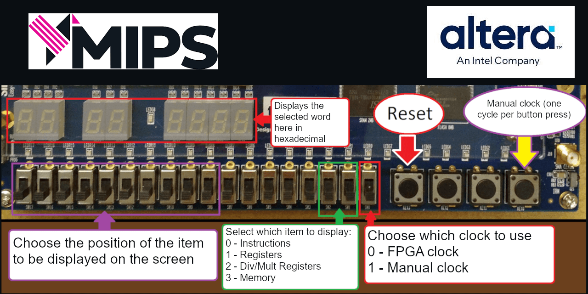
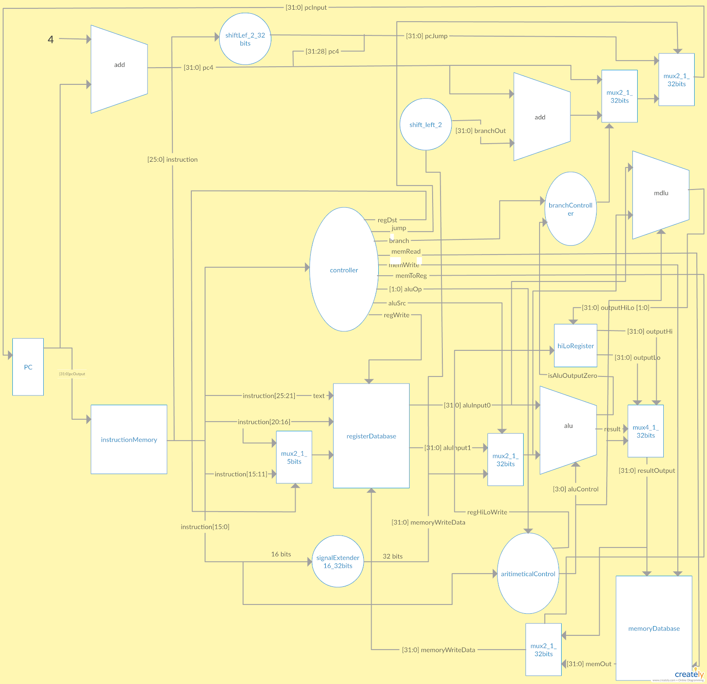
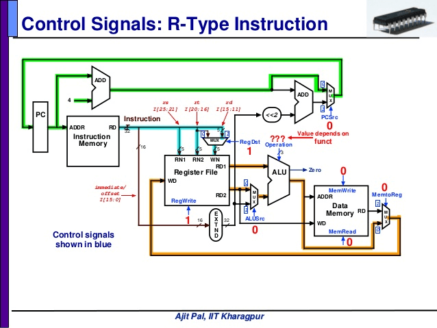

# Data Path Part 1 and 2: MIPS of Integers complete, with pipeline, in SystemVerilog and implemented in FPGA DE2-115 Altera

**Leandro Lazaro Araújo Vieira, Mateus Pinto da Silva**

**Computer Science - Federal University of Viçosa - Campus Florestal (UFV-caf) - Florestal - MG - Brazil**

**Warning.** Note that this readme still needs to be updated!

**Abstract.** This work consists of architecting a non-pipeline MIPS processor in SystemVerilog that can execute the proposed and several additional instructions and implement it on the Altera DE2-115 FPGA. For this, we take as base the division of the processor with pipeline and we apply an additional module of division and multiplication. We also created a small Python makefile to execute the commands, due to the absence of native make for Windows, the operating system that runs the vast majority of architectural design software, including the ones we use.

# How to simulate and work on the FPGA

To perform the job correctly, you must:

● Quartus Prime Lite Edition (for testing on DE2-115)
● FPGA DE2-115 Altera
● Python 3 (for running the makefile)
● Windows (all tests were done using version 10 PRO)

To run, just double-click the "make.py" file.

****  
--
After transferring the synthesized file to the FPGA via Quartus Prime, the board should behave as follows:  

****  

## The choice of the description language and the improvements obtained
We used SystemVerilog language because it is less verbose, has an amazing ability to describe combinational logic in a simple way and allows to create specific always blocks, which allows synthesizing the code without errors compared to basic Verilog.

## The instructions implemented
| == | == | == |
|--|--|-- |
| ADD | LW | J |
| SUB | SW | MFLO |
| AND | BEQ | MULT |
| OR | BNE | DIV |
| SLT | LUI | SLTI |
| SLLV | ANDI | MFHI |
| SRAV | ORI |  |
| XOR | XORI |  |
|  |  | |

## The processor structure
As there are many modules, and the next practical work will be to develop the same processor, but used pipeline, we have previously adopted the division of the five stages with some minor changes in the Instruction-Fetch stage and the Execute increments.

All work files are divided into folders with the same name of the stages inside the color folder, and each stage has a code file with its name, used to reference the modules and encapsulate the stage. The only exceptions are: the processor driver, a library (called a package in the SystemVerilog language) that contains all processor constants as the opcode of instructions and generic modules (such as multiplexers and etc). In addition, there is a folder with fpga integration modules that will be explained in the topic of FPGA Integration, and a module that encapsulates the entire MIPS.

****

### The general controller and MIPS constants
The libMips file contains all constants used in the processor, such as the opcode of each instruction, funcs, ALU and MDLU control codes, and so on, for the purpose of improving the readability and rewritability of the code.
The general mips controller, called controller, receives the six least significant bits of each Instruction-Fetch instruction, that is, the opcode and generates the control signals, preparing the processor to perform some operation.

****
### The Instruction-Fetch stage

The stage seeks the correct instruction and passes it to the next stage, whether it is a jump or not. As control signals, Instruction-Fetch, henceforth IF, receives jump and branchC. As outputs, IFs have the 32 bits corresponding to the instruction being / will be executed. In addition, the stage has a memory with all 256 instructions contained in the processor, and an IO to display them on the FPGA.

If the execution flow is from a statement that is not a deviation, programCounter receives the value of adderProgramCounter that is PC + 4 on the downward edge of the clock, and the next instruction is loaded at the stage output.

However, if the instruction is a conditional jump, the general processor controller will send to stage 1 or 2 in the control signal branchC, which refer to the MIPS BNE and BEQ instruction. This signal is received by the branchController, which combines it with the control signal isAluOutputZero from the ALU output, activates a multiplexer that tells whether the stage should jump to the next instruction or perform the conditional deviation. To do this analysis, branchController, if it receives control signal to perform a BEQ (branch if equals), evaluates if isAluOutputZero is equal to 1, that is, if the subtraction of the two parameters to be evaluated resulted in zero, which means that they are the same. For BNE, something similar is done, but it is verified if the signal isAluOutputZero equals 0, that is, if it is different.

As a last possibility, if the instruction is an unconditional jump, that is, a J, the stage receives 1 in the jump control signal, the 26 bits corresponding to the address are shifted two bits to the left by a generic shifter and are concatenated with the four significant bits of programCounter. Then a multiplexer chooses between the conditional jump output and the unconditional jump address, using the jump control signal.

### The Instruction-Decode stage

This stage is responsible for decoding the instruction, that is, preparing the data that will be used in the execution, which is the next stage. For this, the stage transforms the addresses of the registers into data. In addition, the internship is responsible for saving information on these same registrars. As control signals, the stage receives regDst and regWrite, and outputs the data from two registers and the output of a possible 32-bit extended signal type I instruction. In addition, the stage contains IO outputs from all registers for FPGA integration.

The most important module in the stage is the registerDatabase, which performs readings asynchronously and synchronously (clockwise), making it possible to do both simultaneously. regWrite tells you whether to make a recording or not on that upload edge.

Not much less important, regDst says which part of the instruction code corresponds to the destination register, ie the register that will have its written memory. This treatment is done by a generic 32-bit demultiplexer attached to the registerDatabase write address input.

### The executing stage

Executing is the stage responsible for performing all arithmetic logic operations and is used in almost all instructions, except all types j, such as jump, for example. It contains 6 modules and among them are aritimeticalControl, alu, mdlu and hiLoResgister that deserve a certain highlight.

The aritimeticalControl module is the controller used to decide which operation should be performed by alu or mdlu and whether the special HI and LO registers should be written or not. To decide this, this controller evaluates the signal of a four-bit wire from the controller and, in most cases, the six least significant bits of the instruction. It is important to clarify that the aluOp wire has four bits so that the six least significant bits of some instructions are ignored and the decision of which arithmetic operation to execute is taken exclusively by it.

The alu module is used to perform almost all the operations recognized by the aritimeticalControl, being ADD, SUB, AND, OR, XOR, NOR, LUI, SLL, SLT, SRA and SRL, not being responsible only for performing the operations MULT and DIV . It is also important to remember that the output isAluOutputZero, already mentioned above, is responsible for the decision of conditional deviations and is present in this module. As this has been detailed earlier in topic 4.1, it will not be explained again.

The mdlu is the module capable of performing MULT and DIV, operations not included in the execution list of the module alu. Although for some it seems to be a mistake to devote a logical unit to only two operations, this was a clever choice, since even though these two operations are being executed in a combinational way, due to their nature, they have the peculiarity of saving their results in specific registers called HI and LO, operators that are not used by any other instruction, other than MFHI and MFLO that extract them to a register from the list of registers accessible to other instructions.

HiLoResgister is the module responsible for controlling the HI and LO special registers. This module is only written when a MULT or DIV operation is running on the mdlu, so, as you might imagine, the aritimeticalControl dedicates a wire to this module that, based on its signal, authorizes or not the writing.

### The memory stage

It is the stage responsible for managing processor memory. As a single control stage, it contains the memWrite wire, which tells you if you need to save the value in memory, given the contents to be saved and the address, similar to the Instruction-Fetch register bank. There is an IO output of all memory positions for FPGA integration.

It also counts the possibility to read a value of memory given its address asynchronously, making it able to perform its two functions simultaneously.

### The Write-Back stage

This stage is responsible for telling whether the value to be saved in the register bank will be that of the output of the ALU or the reading output from memory. It receives as control signal the memToReg and uses a generic multiplexer to do this.

## Implementation in FPGA, the problems faced and their solutions

For execution in DE2-115, it was necessary to define how to display the information. We chose to show all instructions, registers (normal and multiplication / division), and MIPS memory positions in hexadecimal using the seven-segment display of the board. Since a word processor contains 32 bits, it would take eight hexadecimal numbers, that is, exactly the number of FPGA displays. However, dereferencing all of this information directly in the project would be impossible, since the creation of links can not be performed by Quartus Prime, so a module was created in SystemVerilog for this.

Another problem would be to define which clock to use. As soon as possible, using only the critical path, it would display logic performance very well, but it would be very difficult to debug a code in MIPS (or debug the processor itself). As a solution, we use a multiplexer called clockChooser (located in the folder fpgaIntegration / fpgaController) that allows to choose between the maximum clock and a manual clock made by a button in the FPGA, which allows to use the processor in normal mode or debug mode. Thanks to the synthesis software, no additional treatment is necessary, since it recognizes that it is a clock demultiplexer and does this treatment automatically.

The Quartus Prime project is in the root folder, and the file is called simpleMips.qpf.

### Creating the Outputs for the FPGA

All processor IOs (instructions, normal and multiplication / division and memory registers) are multiplexed to be displayed on the FPGA display. To do this, the infoChooser module (which is in the fpgaIntegration / fpgaController folder) is used. Using as input select (which selects between memory, registers, etc) and derreference (which chooses the position of the selected object), a 32-bit output with the desired word is loaded using combinational logic.

After that, the displaySevSegm module converts this word into outputs compatible with the eight displays of the DE2-115. For this, eight simple binary-to-hexadecimal-to-seven-bit binary converter modules called binaryToHexSevSegm are used. Both modules are in the fpgaIntegration / displaySevSegm folder.

## Conclusion

Through this work, we demystify the idea that we had of the operation of a computer / processor. Before, we saw the operation at the hardware level as something magical. After work, we realize that it is a relatively simple and very literal operation, at least on RISC processors. Another important thing was to realize that everything that runs on a computer, in the end, are elementary mathematical operations, such as sums, subtractions, and logical operations.

In addition, we had the chance to work with the current Verilog used by Intel, SystemVerilog, which solves major common Verilog problems, such as always blocks that are sometimes not read correctly in the older language. In addition, it has the facility to automatically identify and differentiate wires from registers, failing solely to create links, as perceived during the weeks of development of the work. We also learned how to use ModelSim, a free simulator for students of that language.

We also find the practical application of RISC concepts extremely interesting when viewed in the classroom and even seemingly unimportant. However, when used in practice, they show that they are very welcome, making the performance of the processor much faster and its development simpler.
